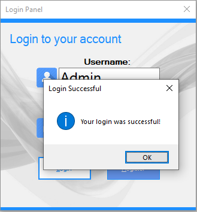
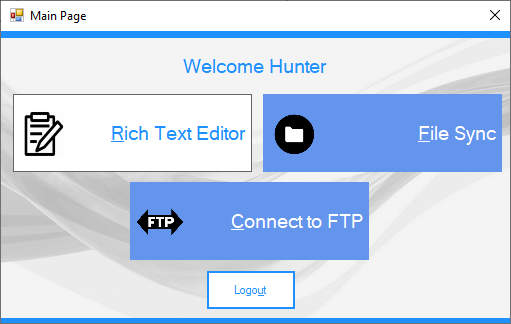

# LoginPanel - Windows Forms

A basic application made with C# and Windows forms that logs a user in using a SQL local database
with Visual Studio. This solution contains each one of the other 3 projects created for the final 
as a separate form once the user logs in.  

* Default Account:
  * *Username:* Admin
  * *Password:* Admin

* Default Account:
  * *Username:* Admin
  * *Password:* Admin

##### Main Screen. Once logged in, you can select which form to bring up 

* These forms have their own separate repositories too. Read the beginning of README

### Prerequisites

Requires *Visual Studio 2017 or higher* to run the application.

## Built With

* C# Windows Forms
* SQL Database with Visual Studio

## Contributing

[Coming Soon]

## Author

Name 	: Rakib Islam 
Email	: rakibislam1412@gmail.com
github	: https://github.com/Rakib665/loginform-csharp.git

